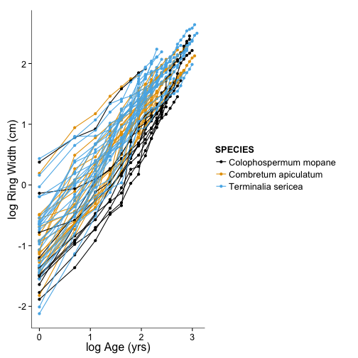

TREE GROWTH INVESTIGATIONS
========================================================


```
## Warning: package 'gridExtra' was built under R version 3.0.2
## Warning: package 'stargazer' was built under R version 3.0.2
```

```
## 
## Please cite as: 
## 
##  Hlavac, Marek (2013). stargazer: LaTeX code and ASCII text for well-formatted regression and summary statistics tables.
##  R package version 4.5.3. http://CRAN.R-project.org/package=stargazer
```

```
## Warning: package 'lme4' was built under R version 3.0.2
```

```
## Loading required package: lattice
## Loading required package: Matrix
```

```
## Warning: package 'Matrix' was built under R version 3.0.2
```

```
## 
## Attaching package: 'lme4'
## 
## The following object is masked from 'package:ggplot2':
## 
##     fortify
```

```
## Warning: package 'extrafont' was built under R version 3.0.2
```

```
## Registering fonts with R
```


```r

myTheme <- theme_tufte() + theme(text = element_text(family = "Arial", size = 16), 
    axis.line = element_line(size = 0.3))


Melon_Sites <- read.csv("Data/Sites/Mellon_Tree.csv")
Melon_Species <- read.csv("Data/MeasuredGrowth/MellonGrant/MellonGrant_Species.csv")
Melon_Growth <- read.csv("Data/MeasuredGrowth/MellonGrant/MellonGrant_TreeGrowth_LongForm.csv")
source("Scripts/WeatherProcessor.R")
```

```
## 
## Attaching package: 'reshape'
## 
## The following object is masked from 'package:Matrix':
## 
##     expand
## 
## The following object is masked from 'package:plyr':
## 
##     rename, round_any
```

```r
PRET2011_RINGW_LongForm <- read.csv("Data/MeasuredGrowth/TrialProject/PRET2011_RINGW_LongForm.csv")


names(Melon_Sites)[2] <- "SAMPLE"

Melon_Master <- merge(Melon_Sites, Melon_Species, by = "SAMPLE")
Melon_Master$Species <- NULL

Melon_Master <- merge(Melon_Master, Melon_Growth, by = "SAMPLE")
Melon_Master$Diam <- NULL
Melon_Master$TTT <- NULL

PRET2011_RINGW_LongForm$Site <- "PRE"
PRET2011_RINGW_LongForm$SPECIES <- "Terminalia sericea"

Melon_Master <- rbind(Melon_Master, PRET2011_RINGW_LongForm)

Melon_Master$RINGW <- Melon_Master$RINGW/1000

Melon_Master <- Melon_Master[order(Melon_Master$SAMPLE, Melon_Master$YEAR), 
    ]

Melon_Master <- ddply(Melon_Master, .(SAMPLE), mutate, Growth = cumsum(RINGW))

Melon_Master$EstCrossSection <- (Melon_Master$Growth)^2 * pi
Melon_Master$EstBasalDiameter <- (Melon_Master$Growth) * 2

Melon_Master <- ddply(Melon_Master, .(SAMPLE), mutate, YearOfGrowth = YEAR - 
    min(YEAR) + 1)

Melon_AllWx <- merge(Melon_Master, Kruger_Wx_Combined, by.x = c("YEAR", "Site"), 
    by.y = c("Year", "Station"))

MAP <- read.csv("Data/Weather/Kruger_MAP.csv")
Melon_AllWx <- merge(Melon_AllWx, MAP, by.x = "Site", by.y = "Station")

naive_growth <- ddply(Melon_AllWx, .(SPECIES, Site, SAMPLE, MAP), summarize, 
    TotalSize = sum(EstBasalDiameter), Age = max(YearOfGrowth), TotalLifeRain = sum(AnnualPrecip), 
    MeanLifeRain = mean(AnnualPrecip))

naive_growth$NaiveRate <- naive_growth$TotalSize/naive_growth$Age


COMO_naive_DF <- subset(naive_growth, SPECIES == "Colophospermum mopane")
COAP_naive_DF <- subset(naive_growth, SPECIES == "Combretum apiculatum")
TESE_naive_DF <- subset(naive_growth, SPECIES == "Terminalia sericea")

COMO_naiveGrowth <- lm(log(TotalSize) ~ 0 + log(Age), data = COMO_naive_DF)
TESE_naiveGrowth <- lm(log(TotalSize) ~ 0 + log(Age), data = TESE_naive_DF)
COAP_naiveGrowth <- lm(log(TotalSize) ~ 0 + log(Age), data = COAP_naive_DF)

# COMO_nls <- nls(TotalSize ~ (a + Age / b + Age), data = COMO_naive_DF,
# start=c(a = 100, b = 8))


COMO_plotDF <- expand.grid(Age = seq(0, 20))
COMO_plotDF$TotalSize <- exp(predict(COMO_naiveGrowth, COMO_plotDF))

COAP_plotDF <- expand.grid(Age = seq(0, 20))
COAP_plotDF$TotalSize <- exp(predict(COAP_naiveGrowth, COAP_plotDF))

TESE_plotDF <- expand.grid(Age = seq(0, 20))
TESE_plotDF$TotalSize <- exp(predict(TESE_naiveGrowth, TESE_plotDF))

TESE_plotDF$SPECIES <- "Terminalia sericea"
COMO_plotDF$SPECIES <- "Colophospermum mopane"
COAP_plotDF$SPECIES <- "Combretum apiculatum"


displayPlotted <- rbind(TESE_plotDF, COMO_plotDF)
displayPlotted <- rbind(displayPlotted, COAP_plotDF)

displayPlotted$Species <- as.factor(displayPlotted$SPECIES)
names(naive_growth)[1] <- "Species"
levels(naive_growth$Species) <- c("C. mopane", "C. apiculatum", "T. sericea")
levels(displayPlotted$Species) <- c("C. mopane", "C. apiculatum", "T. sericea")

```


```r
displayPlotted_plot <- ggplot(data = Melon_Master, aes(x = log(YearOfGrowth), 
    y = log(EstBasalDiameter), colour = SPECIES, group = SAMPLE))
displayPlotted_plot + myTheme + ylab("log Ring Width (cm)") + xlab("log Age (yrs)") + 
    scale_color_colorblind() + geom_point() + geom_line(aes(group = SAMPLE))
```

```
## Warning: unknown AFM entity encountered
## Warning: unknown AFM entity encountered
## Warning: unknown AFM entity encountered
## Warning: unknown AFM entity encountered
```

 


